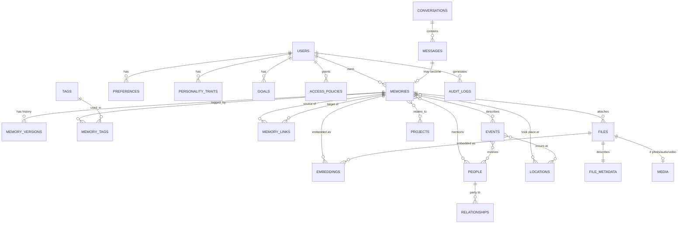

# Database Design

## 1. Design principles

- Every memory is **versioned**, never overwritten in place.
- Every memory records its **provenance** (user-stated, AI-inferred, corrected) and **confidence**.
- Entities (people, places, events, projects) are first-class, so memories can link to them — this is what turns a pile of notes into a knowledge graph.
- Vector embeddings live next to the rows they describe (via `pgvector`), so retrieval never needs a second, separately-consistent store.
- Privacy is a column, not an afterthought: `privacy_level` exists on every content-bearing table and is enforced at the query layer.

## 2. Entity-relationship diagram



## 3. Core tables

### `users`
Single owner today, structured for future authorized "legacy" accounts.
```text
id, email, password_hash, display_name, role, created_at, is_active
```

### `memories`
The central table. One row per *current* memory; history lives in `memory_versions`.
```text
id, user_id, type            -- EPISODIC | SEMANTIC | PREFERENCE | PROCEDURAL | EMOTIONAL | RELATIONSHIP | PROJECT
title, content
source                        -- USER_INPUT | CONVERSATION | FILE_EXTRACTION | AI_INFERENCE
event_date, created_at, updated_at
importance (1-5), confidence (0-1)
privacy_level                 -- PRIVATE | LEGACY_READABLE | LEGACY_FULL
status                        -- ACTIVE | SUPERSEDED | ARCHIVED
current_version_id
```

Enum-valued columns are stored uppercase so they map directly to Java enums (`EnumType.STRING`) without per-enum converters.

### `memory_versions`
Immutable history of every change to a memory. A "correction" creates a new version and flips the prior one to `superseded` — it is never deleted.
```text
id, memory_id, version_number
content, event_date, confidence
change_reason                 -- INITIAL | USER_CORRECTION | AI_RECLASSIFICATION
created_at, superseded_at
```

### `memory_tags` / `tags`
Many-to-many free-form tagging, separate from the structured entity links below.

### `memory_links`
The edges of the knowledge graph. Source/target are both `memories.id`, typed by relation.
```text
id, source_memory_id, target_memory_id, link_type   -- e.g. "follows", "about_same_event", "contradicts", "supersedes"
created_at
```

### `people`
```text
id, user_id, name, aliases[], relationship_to_owner, notes, created_at
```

### `relationships`
Edges between two `people` rows (e.g., "John is Mary's brother"), kept separate from `memory_links` because relationships between people persist independent of any single memory.
```text
id, person_a_id, person_b_id, relationship_type, notes
```

### `events`
```text
id, user_id, title, event_date, description, location_id
```
Join tables `event_people` and the `memories`↔`events` link give events their participants and their narrative record.

### `locations`
```text
id, user_id, name, latitude, longitude, address, notes
```

### `projects`
```text
id, user_id, name, description, status, started_at, ended_at
```

### `conversations` / `messages`
Chat history with the assistant — **separate from long-term memory** per the spec's Section 22.
```text
conversations: id, user_id, started_at, title
messages: id, conversation_id, role (USER|ASSISTANT), content, created_at, promoted_to_memory_id (nullable)
```
`promoted_to_memory_id` is how a message becomes traceable to the memory it produced, without conversation history itself being treated as memory.

### `files` / `file_metadata` / `media`
```text
files: id, user_id, storage_path, content_hash, mime_type, encryption_key_id, uploaded_at, original_filename
file_metadata: file_id, extracted_text, extracted_at, extraction_source
media: file_id, media_type (PHOTO|AUDIO|VIDEO), exif_json, taken_at, duration_seconds, width, height
```
Originals are never modified; `file_metadata`/`media` hold everything derived from them.

### `embeddings`
Polymorphic, so the same table serves memories, messages, and files.
```text
id, owner_type (MEMORY|MESSAGE|FILE_CHUNK), owner_id, chunk_index, embedding vector(768), model_name, created_at
```
`model_name` is stored per row because you will change embedding models over time — old and new embeddings can coexist during a re-embedding migration.

### `preferences` / `personality_traits` / `goals`
Kept structurally separate from `memories` per Section 12 — these describe *who you are*, not *what happened*.
```text
preferences: id, user_id, category, key, value, confidence
personality_traits: id, user_id, trait, description, evidence_memory_ids[]
goals: id, user_id, title, description, status, target_date
```

### `audit_logs`
Append-only.
```text
id, user_id, action, entity_type, entity_id, actor, ip_address, created_at, details_json
```

### `access_policies`
The hook for future Digital Legacy mode (Phase 8) — not enforced until then, but modeled now so the schema doesn't need to change later.
```text
id, owner_user_id, grantee_user_id, scope (READ_ONLY|INTERACTIVE), privacy_levels_included[], active_from, revoked_at
```

### `encryption_metadata`
Tracks *which* data-encryption key protects which row/file, never the key material itself (see [security.md](security.md) for the envelope-encryption model).
```text
id, subject_type, subject_id, key_id, algorithm, created_at
```

## 4. Why this shape, and what it's not

- No `photos` table separate from `files`/`media` — a photo is a file with `media_type = PHOTO`; this avoids parallel near-identical tables for photos/audio/video.
- No separate "WhatsApp" tables — an imported conversation becomes rows in `conversations`/`messages`/`people`, so retrieval doesn't need to special-case the import source.
- Indexing plan: HNSW index on `embeddings.embedding`, B-tree on `memories(user_id, event_date)`, GIN on `memories(privacy_level)` combined with row-level filtering at the query layer, trigram or `tsvector` index on `memories.content` for keyword search (hybrid search, per Section 21).
